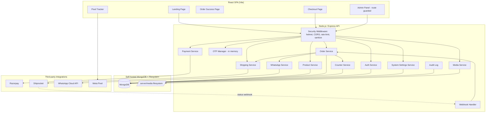

# Design Document

## Overview

Planet of Toys is a single-page React application that serves both a customer storefront and a route-guarded admin panel, backed by a Node.js/Express API and a self-hosted MongoDB database. The platform is optimized for Meta Ads traffic: it drives a visitor from an ad through a product landing page, checkout, payment (Razorpay online or Cash on Delivery), order creation, automated Shiprocket fulfilment, and WhatsApp notifications through delivery.

The design emphasizes three cross-cutting concerns derived from the requirements:

1. **Conversion resilience** — a shipping-provider failure must never block or surface to a customer order (Req 11). Order creation and external fulfilment are decoupled so the customer always receives a clean success outcome.
2. **Secret protection and security** — every secret (integration credentials, JWT secret, encryption key, DB connection string, password hashes, tokens) is server-side only and excluded from frontend responses (Req 5, 10, 14, 19, 22, 27, 29, 30). Credentials managed through System Settings are encrypted at rest with an env-sourced key.
3. **Attribution integrity** — UTM parameters and Meta Pixel events are captured and persisted so every order can be tied back to its ad campaign (Req 2, 3).

This document is grounded in the 30 requirements in `requirements.md`. Each component, data model, and correctness property references the acceptance criteria it satisfies.

### Technology Choices

| Concern | Choice | Rationale / Requirement |
|---|---|---|
| Frontend | React SPA built with Vite | Single SPA for storefront + admin; `VITE_META_PIXEL_ID` build-time var (Req 3.4) |
| Backend | Node.js + Express | Required stack |
| Database | MongoDB (Mongoose ODM) | Self-hosted; atomic counters via `findOneAndUpdate` (Req 8) |
| Payments | Razorpay Node SDK + manual HMAC verify | Server-side signature verification (Req 5) |
| Shipping | Shiprocket REST API + cached token | Token valid ~10 days, auto-refresh (Req 10, 11) |
| Messaging | WhatsApp Business Cloud API (Graph API) | OTP + order notifications (Req 6, 13) |
| Image processing | Sharp (WebP transcoding) | Local media optimization (Req 18) |
| Auth | JWT (jsonwebtoken) + bcrypt | Admin sessions and password hashing (Req 14, 21, 22) |
| Security middleware | helmet, express-rate-limit, express-mongo-sanitize, input sanitization | HTTP headers, rate limits, injection prevention (Req 19, 25, 28) |
| Credential encryption | AES-256-GCM with env-sourced key | Encrypted System Settings (Req 30) |
| OTP store | In-memory map with TTL + sliding-window rate limit | OTP lifecycle (Req 6, 7) |

## Architecture

### System Topology



### Primary Conversion Flow

```mermaid
sequenceDiagram
  participant C as Customer
  participant SPA as React SPA
  participant API as Express API
  participant RZP as Razorpay
  participant OTP as OTP Manager
  participant ORD as Order Service
  participant SHIP as Shipping Service
  participant WA as WhatsApp

  C->>SPA: Click Meta Ad -> Landing Page (?utm_*)
  SPA->>SPA: Store UTM in sessionStorage; fire PageView + ViewContent
  C->>SPA: Proceed to checkout (fire InitiateCheckout)
  SPA->>API: Validate pincode serviceability
  API->>SHIP: Serviceability check
  alt Online payment
    SPA->>API: Create Razorpay order
    API->>RZP: orders.create(amount)
    C->>RZP: Complete payment
    SPA->>API: Verify signature {order_id, payment_id, signature}
    API->>API: HMAC-SHA256 verify (Payment_Status=PAID)
  else Cash on Delivery
    SPA->>API: Request OTP
    API->>OTP: generate + rate-limit check
    OTP->>WA: send OTP template
    C->>SPA: Submit OTP
    SPA->>API: Verify OTP (Payment_Status=PENDING)
  end
  API->>ORD: Create order (Order_Status=CONFIRMED, Shipment_Status=PENDING)
  ORD->>WA: order-confirmed notification
  ORD-->>SPA: Order success (order ID) -- fire Purchase
  Note over ORD,SHIP: Fulfilment runs out-of-band
  ORD->>SHIP: Create Shiprocket order, assign courier, generate AWB
  alt Shiprocket OK
    SHIP->>ORD: AWB + courier (Shipment_Status=CREATED)
  else Shiprocket error/unavailable
    SHIP->>SHIP: Log failure; Shipment_Status stays PENDING; schedule retry
  end
```

### Architectural Principles

- **Decoupled fulfilment**: Order persistence is committed before Shiprocket integration is attempted. A Shiprocket failure leaves `Shipment_Status = PENDING` and never propagates a technical error to the customer (Req 11.5, 11.9). A background retry plus an admin manual-trigger control drive eventual courier assignment (Req 11.7, 11.8).
- **Layered backend**: Express routers → controllers → services → models. Secrets live only in services and config; controllers shape sanitized responses. This enforces "secrets server-side only" (Req 19.1–19.2).
- **Single SPA, dual surface**: The same React bundle serves storefront routes and `/admin/*` routes. Admin routes are guarded client-side by a route guard and server-side by JWT middleware (Req 14, 19.5, 21).
- **Configuration precedence**: Bootstrap secrets (encryption key, JWT secret, DB connection string) are environment-only (Req 29.1). Integration credentials resolve from encrypted System Settings first, falling back to environment variables (Req 29.2, 30).

## Components and Interfaces

### Frontend Components

**Landing Page** (Req 1, 2, 3)
- Composed of the ten conversion-ordered sections defined in the [UI/UX Design System](#uiux-design-system) (Header, Hero, Product Benefits, Demonstration Video, What's Included, Product Features, Specifications, FAQ accordion, Trust Section, Footer). All visual styling consumes the shared design tokens (colors, typography, spacing, radii) rather than ad-hoc values.
- Renders image gallery, video player, name, price, compare-at price, computed discount %, rich description, features, specifications, FAQ accordion, trust badges, and the sticky buy-now control described under [Sticky CTA](#sticky-cta).
- Computes total price reactively from selected quantity.
- Shows out-of-stock indicator and disables buy-now when `stock === 0`.
- Renders not-found view when the slug does not resolve to an active product.
- On mount: captures `utm_*` query params into `sessionStorage` (empty record when absent) and fires Pixel `PageView` + `ViewContent`.
- Mobile-first: on small viewports the Hero stacks images first then product info, keeping the Buy Now action immediately visible; the sticky CTA is pinned to the bottom of the viewport.

**Checkout Page** (Req 4, 5, 6)
- Order summary (product, quantity, total).
- Customer form: name, phone, email, full address, city, state, pincode — with per-field validation messages. Form controls follow the [Form Design tokens](#form-design) (min 48px input height, 10px radius, large touch targets, clear inline validation).
- Pincode serviceability call; blocks submission when non-serviceable.
- Payment method selector (Online / COD). Fires `InitiateCheckout` on entry.
- Online: opens Razorpay checkout, posts signature for verification.
- COD: OTP request + entry flow.
- Primary action uses the Brand Red primary-CTA token; secondary actions use the Brand Blue secondary-CTA token.

**Order Success Page** (Req 20)
- Displays order identifier and summary; fires Pixel `Purchase` with order value.
- Uses the Success color token for the confirmation state and the shared card/typography tokens for the summary.

**Pixel Tracker** (Req 3)
- Thin wrapper over `fbq`. Reads pixel id from `VITE_META_PIXEL_ID` at build time. Exposes `pageView`, `viewContent`, `initiateCheckout`, `purchase(value)`.

**Admin Panel** (Req 15, 16, 17, 30)
- Dark-theme admin shell (professional SaaS palette defined under [Admin Panel Theme](#admin-panel-theme), distinct from the playful customer palette) with route guard that checks JWT presence/validity and redirects to login on expiry.
- Dashboard (order count, revenue, status breakdown), Product management, Order list/detail, System Settings module.

### Backend Service Interfaces

**Auth_Service** (Req 14, 19.5, 21, 22, 25, 26.1)
```
POST /api/admin/login            -> { token } | 401 generic            (rate-limited, brute-force block)
middleware requireAuth(req)      -> verifies JWT signature + expiry
issueToken(admin)                -> jwt.sign(payload, JWT_SECRET, { expiresIn: SESSION_EXPIRATION })
verifyPassword(plain, hash)      -> bcrypt.compare
hashPassword(plain)              -> bcrypt.hash(plain, COST)
```

**Product_Service** (Req 1, 16)
```
GET  /api/products/:slug         -> active product projection (no internal fields)
GET  /api/admin/products         -> list (auth)
POST /api/admin/products         -> create (auth, audit)   generates unique slug
PUT  /api/admin/products/:id     -> update (auth, audit)
PATCH /api/admin/products/:id/state -> toggle active/stock (auth, audit)
DELETE /api/admin/products/:id   -> delete (auth, audit)
generateSlug(name, existing)     -> unique URL-safe slug
```

**Order_Service** (Req 2, 8, 9, 11, 12, 13, 17, 20)
```
createOrder(input, payment, utm) -> persists order:
    Order_Status=CONFIRMED, Shipment_Status=PENDING, status history seeded
    assigns sequential id via Counter_Service
    triggers WhatsApp order-confirmed + async fulfilment
GET  /api/admin/orders           -> filter/search/paginate (auth)
GET  /api/admin/orders/:id       -> detail w/ timeline (auth)
POST /api/admin/orders/:id/cancel-> Order_Status=CANCELLED + history (auth, audit)
applyStatusChange(order, status) -> append status-history entry + WhatsApp dispatch
```

**Counter_Service** (Req 8)
```
nextOrderId(date)                -> atomic findOneAndUpdate({_id:'order-YYMMDD'}, {$inc:{seq:1}}, {upsert,new})
                                    formats POT-YYMMDD-XXXX (XXXX zero-padded)
```

**OTP_Manager** (Req 6, 7)
```
requestOtp(phone)                -> rate-limit (3 / 10 min) then generate 6-digit, store TTL=5min
verifyOtp(phone, code)           -> match + not-expired -> ok; else reject (mismatch/expired)
```

**Payment_Service** (Req 5)
```
POST /api/payment/razorpay-order -> { razorpayOrderId, amount } (secret excluded)   (rate-limited)
verifySignature(orderId, paymentId, signature) ->
    HMAC_SHA256(orderId + '|' + paymentId, RAZORPAY_KEY_SECRET) === signature
```

**Shipping_Service** (Req 4.3, 10, 11, 17.4)
```
checkServiceability(pincode)     -> { serviceable: boolean }
getToken()                       -> cached token; re-auth on missing/expired; retry on 401
createShipment(order)            -> create SR order -> assign courier -> generate AWB
                                    success: store AWB + courier, Shipment_Status=CREATED
                                    failure: log reason, Shipment_Status=PENDING (no throw to caller)
retryPendingShipments()          -> background sweep over PENDING orders
```

**Webhook_Handler** (Req 12, 24)
```
POST /api/webhooks/shiprocket    -> verify authenticity (signature/secret) FIRST
                                    map SR status -> Order_Status; update + history
                                    unmatched order -> reject + record unmatched event
                                    failed auth -> reject + server-side log
```

**WhatsApp_Service** (Req 6.1, 13)
```
sendOtp(phone, code)             -> WhatsApp OTP template
sendNotification(phone, template, params) -> order-confirmed / shipment-created / order-shipped /
                                    out-for-delivery / delivered / cancelled
```

**Media_Service** (Req 18, 23)
```
POST /api/admin/media            -> validate type + size, reject executables/oversized,
                                    transcode images to WebP (Sharp), unique filename,
                                    store under /server/media (auth)
serveMedia                       -> static, non-executing content delivery
```

**System_Settings_Service** (Req 29.2, 30)
```
GET  /api/admin/settings         -> sections w/ masked credentials (auth)
PUT  /api/admin/settings/:section-> validate format -> encrypt -> persist (auth, audit)
POST /api/admin/settings/:section/verify -> live connection test (server-side, no secrets in response)
getCredential(section, key)      -> decrypt for server-side use only (env precedence rules)
```

### Cross-Cutting Middleware

- `helmet()` for HTTP security headers (Req 19.3).
- CORS restricted to configured allowed origins (Req 19.3).
- `express-mongo-sanitize` + XSS input sanitization (Req 19.4).
- Tiered `express-rate-limit`: global public API, OTP, payment, order-creation, and login limiters (Req 19.3, 25.1, 28).
- Central error handler returning generic messages, logging detail server-side (Req 27).

## UI/UX Design System

This section defines the customer-facing visual language and the admin-panel theme for Planet of Toys. It is the single source of truth for design tokens, the landing-page section structure, and component styling that the Frontend Components above reference. The system is **conversion-first and mobile-first**: every decision favors a fast, trustworthy path to the Buy Now action.

### Brand Identity and Principles

The brand reads as **modern, playful, trustworthy, and conversion-focused** — fun and child-friendly for kids, yet clean and professional enough to earn a parent's trust. The customer surface deliberately avoids: cartoon-heavy layouts, excessive animation, cluttered interfaces, dark customer-facing themes, and distracting navigation. The primary objective of every screen is conversion.

Design directives that follow from this identity:
- Lead with the product and the Buy Now action; keep chrome minimal (no category nav, search bar, or account system on the customer surface).
- Use color intentionally — Brand Red is reserved for conversion actions so it never competes with itself.
- Keep motion subtle (hover lifts, gentle transitions); never block or distract from the purchase path.
- Maintain generous whitespace and a consistent spacing rhythm so the page feels calm and premium.

### Design Tokens — Color

Colors are defined once as CSS custom properties on `:root` and consumed everywhere. This guarantees consistency and makes the conversion palette auditable.

```css
:root {
  /* Brand */
  --color-primary:        #F81424; /* Brand Red  — primary CTAs, key actions, discount badges, promo highlights */
  --color-secondary:      #2E3192; /* Brand Blue — headers, icons, navigation elements, section titles */
  --color-accent:         #FFE600; /* Brand Yellow — hover states, highlights, trust elements, feature icons */

  /* Surface & supporting */
  --color-white:          #FFFFFF;
  --color-background:      #F8FAFC;
  --color-text-primary:   #111827;
  --color-text-secondary: #6B7280;
  --color-border:         #E5E7EB;

  /* Semantic */
  --color-success:        #22C55E;
  --color-error:          #EF4444;

  /* Derived interaction state (primary CTA hover = darken 8%) */
  --color-primary-hover:  #E20E1E;
}
```

Usage rules:

| Token | Primary use |
|---|---|
| `--color-primary` (Brand Red) | Primary CTA buttons, important actions, discount badges, promotional highlights |
| `--color-secondary` (Brand Blue) | Headers, icons, navigation elements, section titles |
| `--color-accent` (Brand Yellow) | Hover states, highlights, trust elements, feature icons |
| `--color-background` | Page background behind cards and sections |
| `--color-white` | Card and surface backgrounds |
| `--color-text-primary` | Headings and primary body copy |
| `--color-text-secondary` | Supporting/secondary copy, captions, helper text |
| `--color-border` | Card borders, input borders, dividers |
| `--color-success` / `--color-error` | Validation and status feedback (order success, form errors) |

### Design Tokens — Typography

Two families: **Montserrat** for headings (weights 600/700) and **Inter** for body (weights 400/500). Sizes are responsive, with a mobile-first scale that steps up at the tablet breakpoint.

```css
:root {
  --font-heading: "Montserrat", system-ui, sans-serif; /* 600 / 700 */
  --font-body:    "Inter", system-ui, sans-serif;        /* 400 / 500 */
}
```

| Role | Family / weight | Mobile | Desktop | Used for |
|---|---|---|---|---|
| H1 | Montserrat 700 | 32px | 48px | Hero heading |
| H2 | Montserrat 700 | 28px | 36px | Section titles |
| H3 | Montserrat 600 | 22px | 28px | Product titles, sub-section titles |
| Body | Inter 400/500 | 16px | 16px | Product description, specifications, FAQs, checkout forms |
| Small | Inter 400 | 14px | 14px | Captions, helper text, badges |

Body stays 16px on mobile to keep form fields legible and avoid mobile-browser auto-zoom on focus.

### Design Tokens — Spacing, Radii, and Elevation

A consistent 4px-based spacing scale enforces vertical rhythm between and within sections.

```css
:root {
  /* Spacing scale (4px base) */
  --space-1: 4px;  --space-2: 8px;  --space-3: 12px; --space-4: 16px;
  --space-5: 24px; --space-6: 32px; --space-7: 48px; --space-8: 64px;

  /* Radii */
  --radius-button: 12px;
  --radius-card:   16px;
  --radius-input:  10px;

  /* Elevation */
  --shadow-card:       0 1px 3px rgba(17, 24, 39, 0.08), 0 1px 2px rgba(17, 24, 39, 0.06);
  --shadow-card-hover: 0 6px 16px rgba(17, 24, 39, 0.12);
  --transition-hover:  all 150ms ease-in-out;
}
```

Guidance: use `--space-7`/`--space-8` for separation between the ten landing sections, `--space-4`/`--space-5` for intra-section grouping, and `--space-2`/`--space-3` for tight element pairs (icon + label).

### Responsive Breakpoints

Mobile-first: base styles target the smallest device and scale up. All primary actions must be reachable with one hand, and layouts are explicitly verified at the listed widths.

| Breakpoint | Target widths | Layout intent |
|---|---|---|
| Base (mobile) | 320px, 375px, 390px, 414px | Single column; Hero stacks images then info; sticky Buy Now fixed to bottom |
| Tablet (`>= 768px`) | 768px | Two-up benefit/feature/card grids; typography steps toward desktop scale |
| Desktop (`>= 1024px`) | 1024px+ | Hero splits left (media) / right (purchase panel); multi-column grids; sticky CTA in-flow at top/side |

### Component Tokens

#### Button Design

| Variant | Background | Text | Radius | Height | Hover |
|---|---|---|---|---|---|
| Primary CTA | `--color-primary` (Brand Red) | `--color-white` | `--radius-button` (12px) | 52px | Darken 8% → `--color-primary-hover` |
| Secondary CTA | `--color-secondary` (Brand Blue) | `--color-white` | `--radius-button` (12px) | 52px | Subtle darken + `--shadow-card-hover` |

Primary CTAs are reserved for conversion actions (Buy Now, Confirm Order). Only one primary CTA competes for attention within a viewport region.

#### Card Design

Cards (benefit cards, What's-Included cards, feature cards, order summary) use:
- `border-radius: var(--radius-card)` (16px)
- `background: var(--color-white)`
- `border: 1px solid var(--color-border)` (#E5E7EB)
- `box-shadow: var(--shadow-card)` with a subtle lift to `--shadow-card-hover` on hover (`transition: var(--transition-hover)`)

#### Form Design

Optimized for mobile completion of checkout (Req 4):
- Large touch targets; **input height min 48px**
- Rounded inputs: `border-radius: var(--radius-input)` (10px)
- Clear, inline validation messages using `--color-error` for invalid fields and `--color-success` for confirmed/valid states
- 1px `--color-border` resting border; focus state raises border to `--color-secondary`
- Labels in `--color-text-primary`; helper/validation text in Small size

### Customer Landing Page Structure

The landing page is composed of exactly ten sections in this conversion-driven order. Each maps to product data and to Requirement 1 (and Req 20 for the footer/legal links).

| # | Section | Contents | Notes |
|---|---|---|---|
| 1 | **Header** | Logo, "Contact Us" link, WhatsApp contact button | Minimal. No category nav, no search bar, no account system. |
| 2 | **Hero** | Desktop: left = product images + video; right = name, short description, price, compare price, discount %, quantity selector, Buy Now CTA, "COD Available" badge, shipping info. Mobile: images first, info second, Buy Now immediately visible. | Primary conversion zone; computed discount % and reactive total (Req 1.1, 1.4). |
| 3 | **Product Benefits** | Safe For Kids, Educational Value, Improves Creativity, Premium Quality | Icon + short text cards; Brand Yellow feature icons. |
| 4 | **Product Demonstration Video** | Embedded demo video | Positioned **above** detailed specifications. |
| 5 | **What's Included** | Visual image cards of included items | Image cards, not paragraphs. |
| 6 | **Product Features** | Icons, images, short descriptions | Avoid large text blocks. |
| 7 | **Specifications** | Age Group, Material, Product Dimensions, Product Weight | Rendered from product `specifications` (Req 1.2). |
| 8 | **FAQ** | Accordion | Only one item open at a time (Req 1.2). |
| 9 | **Trust Section** | Secure Payments, Cash On Delivery Available, Fast Shipping, Customer Support | Trust badges (Req 1.3); Brand Yellow trust elements. |
| 10 | **Footer** | About Us, Contact Us, Privacy Policy, Refund Policy, Shipping Policy, Terms & Conditions | Legal/policy links (Req 20.2). |

### Sticky CTA

A sticky Buy Now control showing the **current product price + Buy Now button** remains visible while the customer scrolls, on both desktop and mobile (Req 1.3):
- **Mobile**: fixed to the bottom of the viewport, within one-handed reach.
- **Desktop**: persists within the Hero purchase panel / pinned region as the user scrolls past the Hero.
- Uses the primary-CTA token (Brand Red, 52px, 12px radius) and reflects the reactive total from the quantity selector.

### Admin Panel Theme

The Admin Panel uses a **professional dark theme** — a deliberate departure from the playful customer palette — to convey a focused, SaaS-style management tool (Req 15.2).

```css
:root[data-theme="admin"] {
  --admin-bg:           #0F172A; /* app background */
  --admin-surface:      #1E293B; /* panels, cards, tables */
  --admin-elevated:     #334155; /* raised controls, hover rows, borders */
  --admin-text:         #F8FAFC;
  --admin-text-muted:   #94A3B8;
}
```

The customer-facing brand tokens (Brand Red/Blue/Yellow) are **not** applied to the admin surface; admin accents derive from the slate scale above with semantic `--color-success`/`--color-error` reused only for status indicators.

### Accessibility and Contrast Notes

- Body and supporting text colors (`--color-text-primary` on `--color-white`/`--color-background`) meet WCAG AA contrast for normal text; `--color-text-secondary` is used only for larger/secondary copy where AA still holds.
- White text on Brand Red (primary CTA) and on Brand Blue (secondary CTA) meets AA for large/bold button labels; Brand Yellow is used for accents/icons and hover states, **not** as a text-on-white color, since yellow-on-white fails contrast.
- Focus states are visible on all interactive elements (inputs raise border to Brand Blue; buttons show a focus ring), supporting keyboard navigation.
- Touch targets meet a minimum of 48px (inputs) / 52px (primary CTA) for reliable one-handed mobile use.
- FAQ accordion items expose accessible expand/collapse semantics with only one open at a time.
- Note: full WCAG conformance requires manual testing with assistive technologies and expert accessibility review; these notes establish the baseline design intent.

### Requirements Traceability

This design system supports: the landing-page structure and sticky CTA (Req 1), checkout form ergonomics (Req 4), the admin dark theme (Req 15.2), and the footer/legal-page links (Req 20). It introduces no new functional behavior, data models, or correctness properties — it constrains presentation only.

## Data Models

### Product
```
{
  _id, slug (unique), name, price, compareAtPrice,
  discountPercent (computed: round((compareAt - price)/compareAt * 100)),
  description, features: [string], specifications: [{key, value}],
  faqs: [{question, answer}], images: [mediaRef], video: mediaRef,
  trustBadges: [string], stock: number, active: boolean,
  createdAt, updatedAt
}
```
Discount % is derived; `stock === 0` drives out-of-stock UI; `active=false` and unknown slug both yield not-found (Req 1, 16).

### Order
```
{
  _id, orderId: "POT-YYMMDD-XXXX" (unique),
  customer: { name, phone, email, address, city, state, pincode },
  items: [{ productId, name, quantity, unitPrice }],
  amount: number,
  paymentMethod: "ONLINE" | "COD",
  paymentStatus: "PENDING" | "PAID" | "FAILED",
  razorpay: { orderId, paymentId } (online only; no secret),
  orderStatus: "CONFIRMED"|"PACKED"|"SHIPPED"|"OUT_FOR_DELIVERY"|"DELIVERED"|"CANCELLED"|"RTO",
  shipmentStatus: "PENDING" | "CREATED",
  shipping: { awb?, courier?, shiprocketOrderId? },
  statusHistory: [{ status, timestamp }],
  utm: { source, medium, campaign, term, content } | {},
  createdAt, updatedAt
}
```
Enumerations enforced at the schema level (Req 9.2, 9.3). `statusHistory` appended on every status change (Req 9.4, 12.2). `utm` persisted from session (Req 2.2).

### Counter
```
{ _id: "order-YYMMDD", seq: number }
```
Atomic `$inc` guarantees unique, monotonic sequence numbers per day (Req 8).

### Admin
```
{ _id, email (unique), passwordHash (bcrypt), createdAt }
```
Only bcrypt hash stored; never returned in responses (Req 22).

### OTP Record (in-memory, not persisted)
```
otpStore:    Map<phone, { code, expiresAt }>           // TTL 5 min
rateWindow:  Map<phone, number[] timestamps>           // 3 per 10 min
```
(Req 6, 7).

### AuditLog
```
{ _id, action, adminId, targetType, targetId?, timestamp, metadata? }
```
Server-side only, excluded from customer responses (Req 26).

### SystemSettings
```
{
  _id,
  razorpay:  { keyId, keySecretEnc },
  shiprocket:{ email, passwordEnc },
  whatsapp:  { phoneNumberId, accessTokenEnc, verifyTokenEnc },
  metaPixel: { pixelId },
  updatedAt
}
```
Sensitive values stored AES-256-GCM encrypted; API returns masked values only (Req 30.7–30.9).

### UnmatchedWebhookEvent
```
{ _id, payload, receivedAt, reason }
```
Records webhooks that match no order or fail authenticity (Req 12.4, 24.3).

## Correctness Properties

*A property is a characteristic or behavior that should hold true across all valid executions of a system — essentially, a formal statement about what the system should do. Properties serve as the bridge between human-readable specifications and machine-verifiable correctness guarantees.*

The following properties were derived from the acceptance-criteria prework. Redundant criteria were consolidated so each property provides unique validation value. Criteria classified as EXAMPLE, EDGE_CASE, INTEGRATION, or SMOKE are not listed here; they are covered by the Testing Strategy section.

### Property 1: Discount percentage is correctly computed and bounded

*For any* product where `0 <= price <= compareAtPrice` and `compareAtPrice > 0`, the computed `discountPercent` equals `round((compareAtPrice - price) / compareAtPrice * 100)` and lies within the range `[0, 100]`.

**Validates: Requirements 1.1**

### Property 2: Quantity scales the displayed total

*For any* product unit price `p >= 0` and any selected quantity `q >= 1`, the displayed total equals `p * q`.

**Validates: Requirements 1.4**

### Property 3: Out-of-stock disables purchase exactly when stock is zero

*For any* stock quantity `n >= 0`, the buy-now control is disabled and the out-of-stock indicator is shown if and only if `n == 0`.

**Validates: Requirements 1.5**

### Property 4: Only active products resolve

*For any* slug that does not correspond to an existing active product, the landing-page resolver returns a not-found result and never returns product data.

**Validates: Requirements 1.6**

### Property 5: UTM capture and persistence round-trip

*For any* landing URL, the attribution record stored in sessionStorage equals exactly the `utm_*` parameters present in the URL (an empty record when none are present), and an order created in that session persists that same attribution record unchanged.

**Validates: Requirements 2.1, 2.2, 2.3**

### Property 6: Purchase event carries the order value

*For any* successfully created order with value `v`, the Meta Pixel `Purchase` event payload contains value `v`.

**Validates: Requirements 3.3**

### Property 7: Non-serviceable pincodes block submission

*For any* pincode whose serviceability result is non-serviceable, the checkout prevents order submission for that pincode and surfaces a non-serviceable message.

**Validates: Requirements 4.4**

### Property 8: Invalid checkout forms are rejected with field identification

*For any* checkout form input that is missing or invalid in at least one required field, validation fails, identifies an affected field, and order submission is prevented; *for any* fully valid form, validation passes.

**Validates: Requirements 4.5**

### Property 9: Razorpay signature verification is sound and tamper-evident

*For any* pair `(razorpay_order_id, razorpay_payment_id)`, the signature computed as `HMAC_SHA256(order_id + "|" + payment_id, key_secret)` verifies as valid, and *for any* signature, order id, or payment id that has been altered, verification fails.

**Validates: Requirements 5.2**

### Property 10: Payment status follows signature verification result

*For any* online-payment attempt, the order's `paymentStatus` is `PAID` when signature verification succeeds and `FAILED` (with no confirmed order created) when verification fails.

**Validates: Requirements 5.3, 5.4**

### Property 11: No secret appears in any frontend response

*For any* API response sent to the frontend, the serialized body contains no value of any configured secret (Razorpay key secret, Shiprocket credentials/tokens, JWT secret, encryption key, DB connection string, WhatsApp access/verify tokens), no administrator password hash, no plaintext credential, and no audit-log data.

**Validates: Requirements 5.5, 10.4, 19.1, 22.4, 26.5, 27.4, 30.8, 30.20**

### Property 12: OTP verification succeeds only for the matching, unexpired code

*For any* phone number and freshly generated OTP, verification succeeds with the exact stored code while within the validity period and results in a COD order with `paymentStatus = PENDING`; *for any* submitted code that differs from the stored code, or any code submitted after the 5-minute validity period has elapsed, verification is rejected and no COD order is created.

**Validates: Requirements 6.2, 6.3, 6.4, 6.5, 7.3**

### Property 13: Generated OTP is six numeric digits with a five-minute TTL

*For any* OTP generation at time `t`, the produced code matches `^[0-9]{6}$` and is stored with `expiresAt == t + 5 minutes`.

**Validates: Requirements 7.1, 7.2**

### Property 14: OTP issuance is rate-limited per phone number

*For any* phone number, at most three OTP requests are accepted within any ten-minute window; the fourth and subsequent requests within that window are rejected, and requests are accepted again once the window has elapsed.

**Validates: Requirements 7.4, 28.2**

### Property 15: Order identifier format is well-formed

*For any* order created on date `d` with sequence number `s`, the generated identifier equals `POT-` + `YYMMDD(d)` + `-` + zero-padded `s`, matching `^POT-\d{6}-\d{4,}$`.

**Validates: Requirements 8.1**

### Property 16: Order identifiers are unique

*For any* sequence of order creations (including concurrent creations), all generated order identifiers are distinct.

**Validates: Requirements 8.2, 8.3**

### Property 17: Orders are created with correct initial state

*For any* newly created order, `orderStatus == CONFIRMED`, `shipmentStatus == PENDING`, and the status history contains an initial entry recording `CONFIRMED` with a timestamp.

**Validates: Requirements 9.1, 11.4**

### Property 18: Status and payment values stay within their enumerations

*For any* order at any point in its lifecycle, `orderStatus` is one of {CONFIRMED, PACKED, SHIPPED, OUT_FOR_DELIVERY, DELIVERED, CANCELLED, RTO} and `paymentStatus` is one of {PENDING, PAID, FAILED}; assigning a value outside these sets is rejected.

**Validates: Requirements 9.2, 9.3**

### Property 19: Every status change appends one history entry

*For any* sequence of status changes applied to an order (whether from cancellation or webhook), the status-history length increases by exactly one per change, and the last entry records the new status with a timestamp matching the current status.

**Validates: Requirements 9.4, 12.2, 17.3**

### Property 20: A valid cached Shiprocket token is reused

*For any* sequence of Shipping_Service calls made while a cached token remains valid, Shiprocket authentication is invoked at most once.

**Validates: Requirements 10.2**

### Property 21: Successful Shiprocket fulfilment transitions to CREATED

*For any* successful courier-assignment and AWB-generation result (whether triggered automatically or manually by an Administrator), the order stores the returned AWB and courier details and sets `shipmentStatus == CREATED`.

**Validates: Requirements 11.3, 17.5**

### Property 22: Shipping-provider failure never blocks or leaks to the customer order

*For any* Shiprocket error or unavailability during order creation, courier assignment, or AWB generation, the customer order is retained as successfully created, `shipmentStatus` remains `PENDING`, the customer-facing response indicates success and contains no shipping-provider or technical-failure detail.

**Validates: Requirements 11.5, 11.9, 17.6**

### Property 23: Webhook status mapping updates the matching order

*For any* recognized Shiprocket status received on an authentic webhook for an existing order, the order's `orderStatus` is set to the correctly mapped enumeration value.

**Validates: Requirements 12.1**

### Property 24: Unmatched webhooks are rejected and recorded without mutation

*For any* webhook whose order reference does not match an existing order, the handler rejects it, records an unmatched event, and mutates no order.

**Validates: Requirements 12.4**

### Property 25: Status transitions dispatch the correct WhatsApp templates

*For any* order status transition to SHIPPED, OUT_FOR_DELIVERY, DELIVERED, or CANCELLED, the WhatsApp_Service dispatches exactly the template(s) mapped to that status (SHIPPED dispatches both shipment-created and order-shipped; the others dispatch their single corresponding template).

**Validates: Requirements 13.2, 13.3, 13.4, 13.5**

### Property 26: JWT login round-trip and guard

*For any* administrator with correct credentials, login issues a token whose signature validates and whose decoded expiration equals issue time plus the configured session-expiration; *for any* request to an admin or settings route bearing a missing, expired, or signature-tampered token, the request is rejected.

**Validates: Requirements 14.1, 14.3, 19.5, 21.1, 21.2, 21.4, 30.1, 30.13**

### Property 27: Authentication failures are indistinguishable

*For any* login attempt with a wrong password for a registered email and *for any* login attempt with an unregistered email, the rejection responses are identical and reveal no indication of which credential field was incorrect.

**Validates: Requirements 14.2, 25.3, 25.4**

### Property 28: Dashboard aggregates match the order set

*For any* set of orders, the dashboard revenue equals the sum of the amounts of revenue-eligible orders, the order count equals the set size, and the status breakdown counts equal the per-status tallies of the set.

**Validates: Requirements 15.1**

### Property 29: Product persistence round-trip

*For any* valid product (including active/stock-state toggles), saving then reloading the product returns equal values for all persisted fields.

**Validates: Requirements 16.1, 16.4**

### Property 30: Generated slugs are URL-safe and unique

*For any* set of product names, each generated slug is URL-safe and all generated slugs are distinct.

**Validates: Requirements 16.2**

### Property 31: Order listing filters and paginates correctly

*For any* filter/search criteria and pagination parameters over a set of orders, every returned result satisfies the criteria, and successive pages are non-overlapping and together cover exactly the matching set.

**Validates: Requirements 17.1**

### Property 32: Administrator cancellation sets CANCELLED with history

*For any* order, an Administrator cancellation sets `orderStatus == CANCELLED` and appends a corresponding status-history entry.

**Validates: Requirements 17.3**

### Property 33: Uploaded images are stored as WebP

*For any* accepted image upload, the stored output is a valid WebP file.

**Validates: Requirements 18.2**

### Property 34: Input sanitization neutralizes injection payloads

*For any* request input containing MongoDB operator keys (e.g. keys beginning with `$` or containing `.`) or HTML/script content, the sanitized input has those operators removed/neutralized and HTML escaped, while preserving safe content.

**Validates: Requirements 19.4**

### Property 35: Upload validation enforces type and size

*For any* uploaded file, the upload is accepted only when its type is in the configured allowed set and its size does not exceed the configured maximum; files of disallowed type (including executables) or exceeding the maximum size are rejected.

**Validates: Requirements 23.1, 23.3**

### Property 36: Accepted uploads receive unique filenames

*For any* sequence of accepted uploads (including repeated original filenames), the assigned stored filenames are all distinct, so no existing stored file is overwritten.

**Validates: Requirements 23.4**

### Property 37: Only authentic webhooks are processed

*For any* webhook request that fails authenticity verification, no order is mutated and the event is not processed; processing occurs only for requests whose authenticity verification succeeds.

**Validates: Requirements 24.1, 24.2, 24.4**

### Property 38: Login endpoint rate-limits abusive sources

*For any* source whose failed login attempts exceed the configured threshold within the configured window, further login attempts from that source are blocked until the window elapses.

**Validates: Requirements 25.1, 25.2**

### Property 39: Auditable administrator actions produce audit entries

*For any* auditable Administrator action (successful login, product create/update/delete, order cancellation, manual shipment retry, settings create/update/delete), exactly one Audit_Log entry is recorded capturing the action type, the acting Administrator, and a timestamp.

**Validates: Requirements 26.1, 26.2, 26.3, 26.4, 30.12**

### Property 40: Error responses disclose no internal detail

*For any* internal error raised while processing a request, the customer-facing response is a generic error message containing no stack trace, database schema information, filesystem path, secret, token, or internal server detail.

**Validates: Requirements 27.1, 27.2, 27.3, 27.4**

### Property 41: Rate-limited endpoints reject excess requests

*For any* endpoint with a configured rate limit (public API, OTP, payment creation, order creation), requests beyond the limit within the window receive a rate-limit response.

**Validates: Requirements 28.1, 28.3, 28.4, 28.5**

### Property 42: Startup requires all mandatory environment variables

*For any* configuration in which a required environment variable (encryption key, JWT secret, database connection string, and other required vars) is missing, application startup fails; when all required variables are present, startup proceeds.

**Validates: Requirements 29.5**

### Property 43: Integration credential resolution follows precedence

*For any* integration and any combination of credential sources, `getCredential` returns the encrypted System_Settings value when present and falls back to the environment-variable value otherwise.

**Validates: Requirements 29.2**

### Property 44: bcrypt password storage round-trip

*For any* administrator password, the stored value is a bcrypt hash distinct from the plaintext, `bcrypt.compare(correctPassword, hash)` returns true, and `bcrypt.compare(anyDifferentPassword, hash)` returns false.

**Validates: Requirements 14.4, 22.1, 22.2, 22.3**

### Property 45: Credential encryption round-trip

*For any* credential value, the stored form is ciphertext distinct from the plaintext, and `decrypt(encrypt(value))` returns the original value.

**Validates: Requirements 30.7**

### Property 46: Stored credentials are displayed masked

*For any* stored credential, the value returned for display is masked such that the full plaintext is never present (revealing at most a configured non-sensitive suffix).

**Validates: Requirements 30.9**

### Property 47: Invalid credential formats are rejected without persistence

*For any* credential submitted in an invalid format, the System_Settings module reports a configuration error and persists nothing.

**Validates: Requirements 30.14**

## Error Handling

The platform applies a layered error strategy that prioritizes customer-facing resilience and zero information disclosure.

### Central Error Handler
- A single Express error-handling middleware catches all thrown/rejected errors.
- Customer-facing responses are reduced to a generic message and an appropriate HTTP status; stack traces, schema details, filesystem paths, secrets, tokens, and internal identifiers are never serialized (Req 27.1–27.4, validated by Property 40).
- Full error detail (message, stack, context) is written only to the server-side log (Req 27.5).

### Integration Failure Handling
- **Shiprocket**: All fulfilment calls are wrapped so failures are caught, logged with a reason, and never thrown to the order-creation path. The order is committed first; `shipmentStatus` stays `PENDING`; a background sweep and admin manual trigger drive retries (Req 11.5–11.9, 17.6, validated by Property 22). Token expiry triggers transparent re-authentication and a single retry (Req 10.3).
- **Razorpay**: Order-creation failures surface as a generic checkout error; signature-verification failure sets `paymentStatus = FAILED` without creating a confirmed order (Req 5.4, Property 10).
- **WhatsApp**: Notification send failures are logged and do not block order creation or status transitions (best-effort delivery).
- **Webhooks**: Authenticity failure and unmatched-order events are rejected, logged, and recorded without mutating data (Req 12.4, 24, Properties 24 and 37).

### Validation and Input Errors
- Checkout and admin inputs are validated server-side; validation errors return field-level messages to the client without exposing internals (Req 4.5).
- All request input is sanitized against XSS and MongoDB operator injection before reaching service logic (Req 19.4, Property 34).
- Upload errors (disallowed type, oversized, executable) return explicit rejection responses (Req 23, Property 35).

### Authentication and Authorization Errors
- Login failures and unknown emails return a single generic message (Req 14.2, 25.3–25.4, Property 27).
- Missing/expired/invalid JWTs yield 401; the SPA route guard redirects expired sessions to login (Req 21.2–21.3, Property 26).
- Rate-limit breaches return a standard rate-limit response (Req 28.5, Property 41).

### Startup Validation
- On boot, the application validates presence of all required environment variables and fails fast (process exits) if any are missing (Req 29.4–29.5, Property 42).

## Testing Strategy

The platform uses a dual approach: **property-based tests** for universal logic properties and **example/integration/smoke tests** for UI rendering, external-service wiring, and configuration.

### Property-Based Testing

PBT is applied to the pure-logic and invariant-bearing parts of the backend and shared utilities, where behavior varies meaningfully with input and 100+ iterations reveal edge cases.

- **Library**: `fast-check` (integrated with the chosen test runner — Vitest/Jest — for both frontend utilities and backend services). PBT is not implemented from scratch.
- **Iterations**: Each property-based test runs a minimum of **100 iterations**.
- **Traceability**: Each property test is tagged with a comment referencing its design property, using the format:
  `// Feature: planet-of-toys-ecommerce, Property {number}: {property_text}`
- **Coverage**: Each of Properties 1–47 is implemented by a **single** property-based test. External dependencies (Razorpay SDK, Shiprocket API, WhatsApp API, MongoDB where needed) are mocked or run against an in-memory MongoDB so properties test our logic cheaply.

Representative generators:
- Products (price/compareAt within valid bounds, stock, names) for Properties 1–4, 29, 30.
- UTM parameter combinations and URLs for Property 5.
- `(order_id, payment_id)` strings and tampering mutations for Property 9.
- Phone numbers, code sequences, and synthetic clocks for Properties 12–14.
- Dates and sequence numbers for Properties 15–16.
- Status-transition sequences for Properties 17–19, 25, 32.
- Arbitrary objects/strings with injected `$`-keys and HTML for Property 34.
- File descriptors (type, size, name) for Properties 35–36.
- Credential strings for Properties 44–47.

### Example-Based Unit Tests

For specific scenarios and UI presence that are not universal:
- Landing/checkout/success page rendering and section presence (Req 1.2–1.3, 4.1–4.2, 4.6, 20.1).
- Pixel `PageView`/`ViewContent`/`InitiateCheckout` firing with mocked `fbq` (Req 3.1–3.2).
- Shiprocket token refresh-on-401 (Req 10.3), background retry sweep (Req 11.7), manual-trigger control presence (Req 11.8).
- Webhook "no manual status control" architecture check (Req 12.3).
- Product delete and media association (Req 16.3, 16.5).
- Admin dark theme (Req 15.2), settings sections/fields and Test-Connection action (Req 30.2–30.6, 30.15).
- Logging side-effects for shipment failure, webhook auth failure, and error handling (Req 11.6, 24.3, 27.5).

### Integration Tests (1–3 examples each)

For external-service behavior and wiring that does not vary meaningfully with input:
- Razorpay order creation (Req 5.1), pincode serviceability (Req 4.3), Shiprocket auth + create/assign/AWB happy path (Req 10.1, 11.1–11.2), WhatsApp order-confirmed send (Req 6.1, 13.1), and live credential verification (Req 30.16–30.18).
- Media stored under `/server/media` and served as static, non-executing content (Req 18.1, 23.5).

### Smoke / Configuration Tests (single execution)

- `VITE_META_PIXEL_ID` read at build time (Req 3.4).
- No third-party object storage in use (Req 18.3).
- Security headers, restricted CORS, and rate limiters mounted (Req 19.3).
- Bootstrap secrets sourced only from environment; secrets excluded from source control (Req 29.1, 29.3, 30.11).

### Why some areas omit property-based testing

UI layout/visual behavior, external-service responses, one-time configuration, and logging side-effects do not yield meaningful "for all inputs" statements, so they are covered by example, integration, and smoke tests rather than PBT — consistent with the classification recorded in the prework analysis.
